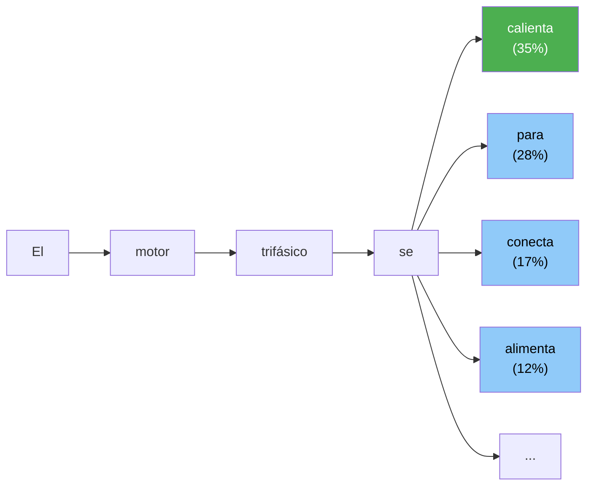
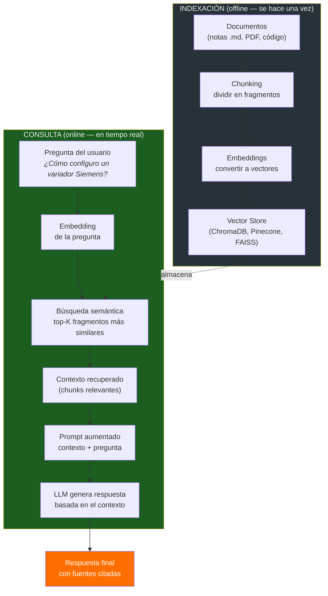
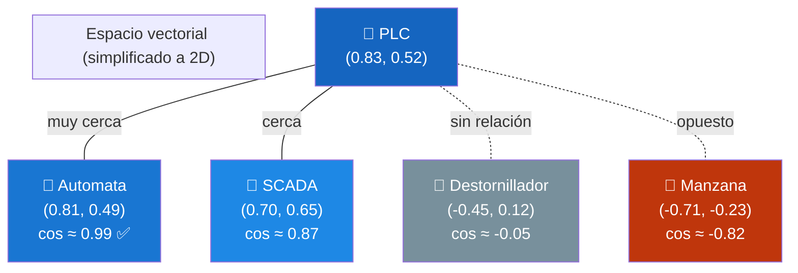
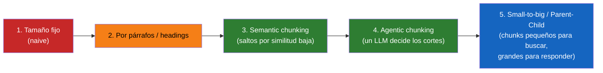
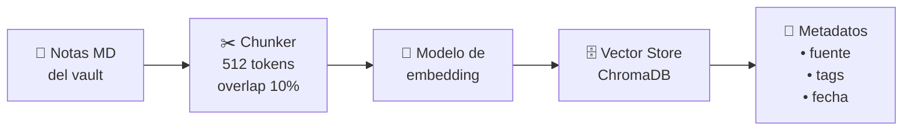
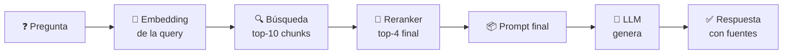
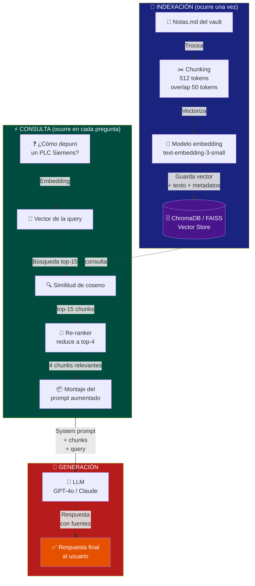

# RAG, LLM, Embeddings, Chunking y Contexto — Guía desde Cero

> **Vamos a entender RAG desde la base, pieza a pieza, sin magia.**  

---

## 1.  ¿Qué es RAG y por qué se usa en este vault?

RAG (por sus siglas en inglés, _Retrieval-Augmented Generation_, o Generación Aumentada por Recuperación) es una técnica de inteligencia artificial que mejora las respuestas de un modelo de lenguaje (como ChatGPT) conectándolo a una fuente de información externa, privada o actualizada antes de que conteste. Funciona como darle un libro de texto abierto a la IA para que busque la respuesta correcta en lugar de responder solo de memoria


Este *second brain* contiene conocimiento del sector de ingeniería y tecnología disperso en cientos de notas. Hoy toca usar **`Ctrl+Shift+F`** y leer nota por nota. Con RAG podríamos:

| Problema actual | Solución con RAG |
|---|---|
| Buscar "cómo configurar una fuente conmutada" y obtener resultados por palabras sueltas | El sistema **entiende la intención** y devuelve la respuesta sintetizada de varias notas |
| Leer 5 notas para armar un procedimiento completo | El LLM **redacta la respuesta combinando** las fuentes relevantes |
| Un compañero nuevo tarda horas en orientarse | Pregunta en lenguaje natural: *"¿Qué sabe el grupo sobre PLC Siemens?"* y obtiene resumen con enlaces a notas |
| Notas sin enlazar se pierden | RAG las encuentra por **similitud semántica**, no por palabras exactas |

---

## 2.  ¿Qué es un LLM?

Un **Large Language Model (LLM)** es una red neuronal entrenada con cantidades masivas de texto para predecir la siguiente palabra más probable en una secuencia. Ejemplos: GPT-5.6, Claude 4.8, Gemini 3.1, Llama 3.1, DeepSeek-V4, Mistral.

### 2.1 ¿Cómo funciona? Ejemplo visual con tokens

Imagina que escribes: *"El motor trifásico se"*



El LLM asigna una **probabilidad** a cada posible siguiente palabra (token). Elige la más probable o introduce algo de aleatoriedad (temperatura) para variar. Así, palabra a palabra, construye la respuesta.

### 2.2 Limitaciones clave de los LLMs

| Limitación | Descripción |
|---|---|
| **Alucinaciones** | Inventan datos con total seguridad. Pregunta: *"¿Cuál es la resistencia R47 del PLC?"* y puede inventar un valor inexistente. |
| **Ventana de contexto** | Tienen memoria limitada (4k–1M tokens según modelo). No pueden "leer" todo el vault de golpe. |
| **Conocimiento congelado** | Saben hasta la fecha de entrenamiento. No conocen los apuntes que escribiste ayer. |
| **Sin fuente privada** | No acceden a tus notas, esquemas, código propietario ni BBDD internas a menos que se lo des. |
| **Coste y latencia** | Modelos grandes son caros y lentos. Un GPT-4o puede costar 5-10 $/M tokens de salida. |
| **Razonamiento limitado** | Resuelven bien lo frecuente; fallan en razonamiento multi-paso complejo sin ayudas externas. |

---

## 3.  ¿Qué es RAG? El proceso completo

**RAG** (*Retrieval-Augmented Generation*) resuelve el mayor problema de los LLM: **darles acceso a tu conocimiento privado en tiempo real sin reentrenarlos.**

En lugar de pedirle al LLM que sepa todo de memoria, RAG:

1. Toma tu pregunta
2. Busca los documentos más relevantes en tu base de conocimiento
3. Le pasa pregunta + documentos al LLM
4. El LLM responde **basándose en esos documentos**, no en su memoria

### 3.1 Flujo RAG end-to-end



### 3.2 Por qué el LLM no es el protagonista en RAG

En RAG, el LLM hace de **redactor**. Su trabajo no es recordar, sino:

- **Sintetizar** la información recuperada
- **Responder en lenguaje natural**
- **Citar fuentes** (si se le pide)
- **Decir "no lo sé"** si el contexto no contiene la respuesta  (muy clave esto)

El verdadero valor está en la **calidad de la recuperación**: si los chunks devueltos son malos, la respuesta será mala, da igual el modelo.

---

## 4.  Embeddings: el motor semántico de RAG

Un **embedding** es una representación numérica (vector) de un texto en un espacio de alta dimensión. Palabras o frases con significado similar quedan cerca en ese espacio.

### 4.1 Similitud de coseno: la distancia semántica

El **coseno del ángulo** entre dos vectores mide su similitud:

$$\text{sim}(A, B) = \frac{A \cdot B}{||A|| \cdot ||B||}$$

- **1.0** → vectores idénticos (mismo significado)
- **0.0** → ortogonales (sin relación)
- **-1.0** → opuestos



> **Nota técnica:** en la realidad los vectores tienen 768–4096 dimensiones. Aquí se proyectan a 2D para visualizar. La magia es que "PLC" y "Autómata" están cerca aunque no compartan ni una letra.

### 4.2 Modelos de embedding relevantes en 2026

| Modelo | Dimensiones | Coste aprox. (1M tokens) | Ideal para |
|---|---|---|---|
| **OpenAI text-embedding-3-small** | 512/1536 | $0.02 | MVP, presupuesto ajustado |
| **OpenAI text-embedding-3-large** | 256/1024/3072 | $0.13 | Máxima precisión |
| **Cohere Embed v3** | 1024 | $0.10 | Multilingüe, buena relación calidad/precio |
| **BGE-M3 (BAAI)** | 1024 | Gratis (self-host) | Open source, multilingüe, documentos técnicos |
| **Jina Embeddings v3** | 1024 | Desde $0.02 | Documentos largos (hasta 8K tokens) |
| **Nomic Embed Text v2** | 768 | Gratis (self-host) | Open source, rendimiento comparable a OpenAI Ada |

### 4.3 Costes estimados para indexar el vault

Si este vault tiene ~300 notas con ~500 tokens cada una (≈150K tokens):

| Modelo | Coste indexación | Coste 1000 consultas |
|---|---|---|
| text-embedding-3-small | $0.003 | $0.003 |
| text-embedding-3-large | $0.02 | $0.02 |
| BGE-M3 (local) | $0 (CPU/GPU) | $0 |
| Cohere Embed v3 | $0.015 | $0.015 |

> **Conclusión práctica:** indexar todo el vault cuesta céntimos. La consulta también. El gasto real viene del **LLM generador**, no del embedding.

---

## 5.  Chunking: trocear para recuperar mejor

El *chunking* es cómo divides tus documentos en fragmentos que se almacenan en la vector store. Es **el paso más infravalorado y crítico** de RAG.

### 5.1 El problema del chunking mal hecho

| Problema | Ejemplo |
|---|---|
| Chunk demasiado grande (2000 tokens) | Recuperas un fragmento enorme con 80% de información irrelevante. El LLM se satura. |
| Chunk demasiado pequeño (50 tokens) | *"El motor se"* no tiene contexto. Recuperas basura. |
| Corte arbitrario a mitad de concepto | *"La resistencia R47 del PLC Siemens S7-1200 se"* — y el chunk acaba. Respuesta inútil. |
| Sin solapamiento | Pierdes el hilo entre chunks contiguos. La respuesta queda incompleta. |

### 5.2 Estrategias de chunking (de peor a mejor)



#### Estrategias en detalle

| Estrategia | Cómo funciona | Ventajas | Desventajas |
|---|---|---|---|
| **Tamaño fijo** | Cortas cada N tokens sin mirar contenido | Simple | Rompe frases y conceptos |
| **Por párrafos / headings** | Respetas estructura Markdown (títulos, párrafos) | Conserva estructura lógica | Puede dejar chunks muy desiguales |
| **Semántico** | Mides similitud entre frases consecutivas; cortas donde baja | Corte natural por cambio de tema | Más lento, requiere embeddings previos |
| **Agentic** | Un LLM pequeño decide dónde cortar | Máxima calidad | Costoso, lento |
| **Parent-Child (recomendado)** | Indexas chunks pequeños (256 tokens) para búsqueda precisa, pero pasas al LLM el chunk ampliado (1024 tokens) con contexto | Precisión + contexto | Complejidad media |

### 5.3 Parámetros recomendados para este vault

| Parámetro                | Valor recomendado                       | Por qué                                                                                  |
| ------------------------ | --------------------------------------- | ---------------------------------------------------------------------------------------- |
| Tamaño de chunk          | 512–768 tokens                          | Las notas de este vault son atómicas y técnicas. Tamaño medio captura una idea completa. |
| Solapamiento (*overlap*) | 10–15% (50–100 tokens)                  | Para no perder transiciones entre conceptos                                              |
| Separador                | `## ` (headings markdown)               | Respeta la estructura de las notas del vault                                             |
| Estrategia               | Parent-Child si puedes, semántico si no | Calidad sin complejidad extrema                                                          |

---

## 6.  Contexto: la ventana que todo lo limita

El **contexto** es el límite de tokens que un LLM puede procesar en una sola petición. Es el recurso más escaso en RAG.

| Modelo (2024) | Ventana de contexto | Equivalente aprox. |
|---|---|---|
| GPT-4o | 128K tokens | ~300 páginas |
| Claude 3.5 Sonnet | 200K tokens | ~500 páginas |
| Gemini 2.0 Pro | 2M tokens | ~3000 páginas |
| GPT-4.1 | 1M tokens | ~1500 páginas |
| DeepSeek-V3 | 128K tokens | ~300 páginas |

### 6.1 Cómo se reparte el contexto en RAG

```
+-------------------------------------------------------+
|              VENTANA DE CONTEXTO (128K tokens)         |
|                                                       |
| [System Prompt: 500 tokens]                           |
| [Chunk 1 recuperado: 800 tokens]                      |
| [Chunk 2 recuperado: 750 tokens]                      |
| [Chunk 3 recuperado: 700 tokens]  ←  top-K            |
| [Chunk 4 recuperado: 600 tokens]                      |
| [Chunk 5 recuperado: 550 tokens]                      |
| [...]                                                 |
| [Pregunta del usuario: 50 tokens]                     |
| [...]                                                 |
| [ESPACIO PARA RESPUESTA: ~4K-8K tokens]               |
+-------------------------------------------------------+
```

### 6.2 Reglas prácticas

| Regla | Explicación |
|---|---|
| **top-K entre 3 y 8** | Más chunks recuperados = más contexto, pero más ruido y más coste |
| **Chunks de 512-1024 tokens** | Tamaño suficiente para capturar una idea atómica sin desperdiciar contexto |
| **Deja margen para la respuesta** | Si la ventana es 128K, no uses más de 100K para contexto+pregunta |
| **Reranking** | Recuperas top-20 con embedding barato, reordenas con modelo más fino y te quedas con top-5 |

---

## 7. 🔗 RAG End-to-End: de la nota a la respuesta

### Paso 1 — Indexación (offline)



### Paso 2 — Consulta (online)



### Paso 3 — El prompt aumentado (lo que realmente ve el LLM)

```
Eres un asistente técnico que responde basándose ÚNICAMENTE en el
contexto proporcionado. Si no encuentras la respuesta, di "No tengo
información suficiente en el contexto" y no inventes.

--- CONTEXTO (fragmentos de notas del vault) ---
[Chunk 1 — Nota "Fuente conmutada 24V.md"]
La fuente conmutada requiere un fusible de entrada de 2A...
[Chunk 2 — Nota "Mantenimiento cuadro eléctrico.md"]  
Antes de intervenir, verificar tensión con multímetro en bornes...
[Chunk 3 — Nota "PLC Siemens S7-1200.md"]
Para configurar una salida analógica 0-10V usar el bloque NORM_X...

--- PREGUNTA DEL USUARIO ---
¿Cómo configuro una fuente conmutada de 24V y qué seguridad debo tener?

--- RESPUESTA (solo basada en el contexto) ---
```

### Paso 4 — Diagrama Exalidraw / Mermaid completo del sistema RAG



---

## 8.  Conclusiones de expertos (AI Engineers, 2024–2026)

> *"RAG is the bridge between frozen LLM knowledge and live, private data. The retrieval quality determines the answer quality — invest in chunking and reranking before upgrading your LLM."*  
> — **Jerry Liu**, creador de *LlamaIndex*

> *"The naive RAG pipeline works for a demo. Production RAG needs chunking strategy, metadata filtering, hybrid search, reranking, caching, and observability. It's a data engineering problem, not an ML problem."*  
> — **Eugene Yan**, AI Engineer en *Amazon*

> *"Your RAG is only as good as your retrieval. If the right chunk isn't in the top-K, it doesn't matter what LLM you use."*  
> — **Anton Troynikov**, CTO de *ChromaDB*

> *"Treat your knowledge base as a product. Schema design, chunk taxonomy, and metadata hygiene matter more than the model choice."*  
> — **Shawn Wang (swyx)**, AI Engineer, autor de *Latent Space*

> *"La recuperación semántica con embeddings es el núcleo de RAG, pero el chunking y el reranking son los diferenciadores que separan un prototipo de un sistema utilizable en industria."*  
> — **Apuntes del Máster en IA, UPM (Universidad Politécnica de Madrid), 2024**

### Principios clave que todo experto repite

1. **Chunking > Modelo.** Gasta más tiempo en cómo troceas que en qué LLM usas.
2. **Reranking es barato y efectivo.** Recupera 20 chunks con embedding barato y rerankea a top-3 con un modelo fino.
3. **Híbrido siempre.** Combina búsqueda semántica (embeddings) + búsqueda por palabras clave (BM25).
4. **Metadatos = navegabilidad.** Filtra por `#plc`, `#python`, `2026` antes de buscar semánticamente.
5. **Observabilidad desde el día 1.** Guarda query, chunks recuperados y respuesta para depurar.
6. **Evalúa con preguntas de verdad.** No con benchmarks sintéticos. Las preguntas de la gang son el mejor test set.

---

## 9.  Cómo seguir aprendiendo (ruta de estudio)

| Orden | Tema | Recurso recomendado |
|---|---|---|
| 1 | Conceptos básicos de LLMs | Curso *"ChatGPT Prompt Engineering for Developers"* — DeepLearning.AI |
| 2 | Embeddings y búsqueda | *"Vector Databases: from Embeddings to Applications"* — DeepLearning.AI |
| 3 | RAG práctico | Tutorial *"Building RAG from Scratch"* — Documentación de LlamaIndex |
| 4 | RAG avanzado | *"Advanced RAG"* — LangChain docs + blog de Eugene Yan |
| 5 | Chunking y reranking | Paper *"Semantic Chunking for RAG"* (LangChain blog) |
| 6 | Evaluación | Framework *RAGAS* (ragas.io) + tutorial de evaluación en LlamaIndex |
| 7 | Deploy | ChromaDB + FastAPI + Streamlit para un MVP interno |

---

## 🔗 Referencias

- Lewis et al. (2020). *Retrieval-Augmented Generation for Knowledge-Intensive NLP Tasks*. Meta AI. [[arXiv:2005.11401]](https://arxiv.org/abs/2005.11401)
- Documentación oficial de **LlamaIndex**: [docs.llamaindex.ai](https://docs.llamaindex.ai)
- Documentación oficial de **LangChain**: [python.langchain.com](https://python.langchain.com)
- Documentación de **ChromaDB**: [docs.trychroma.com](https://docs.trychroma.com)
- Blog de **OpenAI** sobre embeddings: [platform.openai.com/docs/guides/embeddings](https://platform.openai.com/docs/guides/embeddings)
- Blog de **Cohere**: [cohere.com/blog](https://cohere.com/blog)
- Blog de **Eugene Yan**: [eugeneyan.com](https://eugeneyan.com)
- Blog de **Anton Troynikov** (ChromaDB): [trychroma.com/blog](https://www.trychroma.com/blog)
- Paper **BGE-M3** (multilingual embeddings): [arXiv:2402.03216](https://arxiv.org/abs/2402.03216)
- Máster Universitario en Inteligencia Artificial — **Universidad Politécnica de Madrid (UPM)** — Apuntes del módulo de NLP y Recuperación de Información
- Máster en Data Science — **Universitat Oberta de Catalunya (UOC)** — Material de PLN y embeddings
- Grados en Ingeniería Informática — **UC3M** — Apuntes de Procesamiento del Lenguaje Natural

---

[[Mapa de Navegación (General)]] <---(por aquí vuelves a casa )
